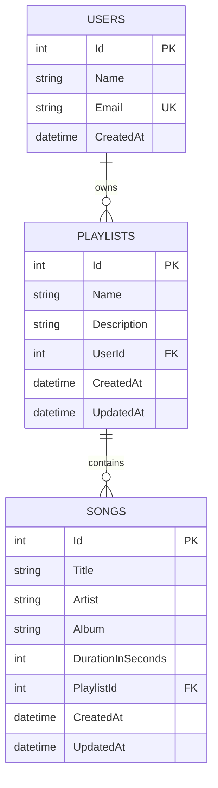

# Database Documentation

## Overview

The Playlist API uses **SQL Server** as its relational database, accessed through **Entity Framework Core 10** (code-first approach with migrations).

## Why SQL Server?

- The data is inherently **relational**: users own playlists, and playlists contain songs — clear one-to-many hierarchies.
- **Foreign keys** enforce referential integrity at the database level (e.g. a song cannot reference a non-existent playlist).
- **Entity Framework Core** has first-class, mature support for SQL Server, which keeps the codebase simple and avoids provider-specific workarounds.
- SQL Server runs consistently and reproducibly via **Docker Compose**, so any reviewer can start an identical database with one command, regardless of their host OS.
- The dataset size and query patterns for this assessment don't require a NoSQL document/key-value model — normalized relational tables are simpler to reason about and query here.

## Entity-Relationship Diagram



## Tables

### Users

| Column | Type | Constraints |
|---|---|---|
| Id | int | Primary Key, Identity |
| Name | nvarchar(100) | Required |
| Email | nvarchar(200) | Required, Unique index |
| CreatedAt | datetime2 | Required |

### Playlists

| Column | Type | Constraints |
|---|---|---|
| Id | int | Primary Key, Identity |
| Name | nvarchar(150) | Required |
| Description | nvarchar(500) | Optional |
| UserId | int | Required, Foreign Key → Users.Id, Cascade delete, Indexed |
| CreatedAt | datetime2 | Required |
| UpdatedAt | datetime2 | Required |

### Songs

| Column | Type | Constraints |
|---|---|---|
| Id | int | Primary Key, Identity |
| Title | nvarchar(200) | Required |
| Artist | nvarchar(200) | Required |
| Album | nvarchar(200) | Optional |
| DurationInSeconds | int | Optional |
| PlaylistId | int | Required, Foreign Key → Playlists.Id, Cascade delete, Indexed |
| CreatedAt | datetime2 | Required |
| UpdatedAt | datetime2 | Required |

## Relationships

- One `User` → many `Playlists` (cascade delete: deleting a user deletes their playlists)
- One `Playlist` → many `Songs` (cascade delete: deleting a playlist deletes its songs)

## Seed Data

Two users are seeded via the `InitialCreate` migration so the API can be exercised without an authentication system:

| Id | Name | Email |
|---|---|---|
| 1 | Alice Johnson | alice@example.com |
| 2 | Bob Smith | bob@example.com |

## Migrations

Migrations live in `src/PlaylistApi/Migrations/`. To apply them:

```bash
dotnet ef database update --project src/PlaylistApi
```

To add a new migration after changing entities:

```bash
dotnet ef migrations add <DescriptiveName> --project src/PlaylistApi
```